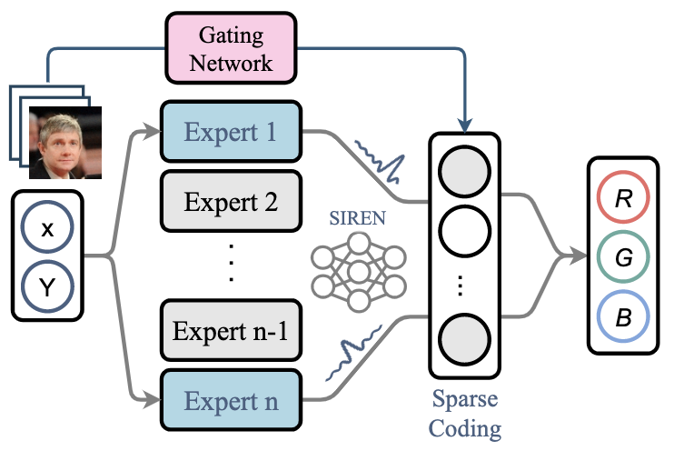
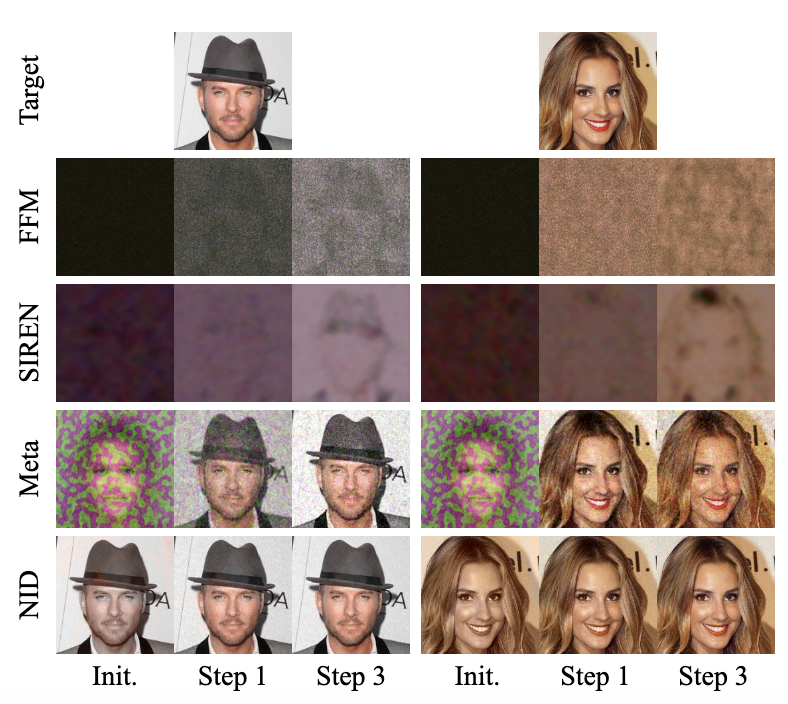

# Neural Implicit Dictionary via Mixture-of-Expert Training

[](https://opensource.org/licenses/MIT)

The official implementation of ICML 2022 paper [Neural Implicit Dictionary Learning via Mixture-of-Expert Training](https://proceedings.mlr.press/v162/wang22d.html).

Peihao Wang, Zhiwen Fan, Tianlong Chen, Zhangyang (Atlas) Wang

(Code under development)

## Introduction

Representing visual signals by coordinate-based deep fully-connected networks has been shown advantageous in fitting complex details and solving inverse problems than discrete grid-based representation. However, acquiring such a continuous Implicit Neural Representation (INR) requires tedious per-scene training on tons of signal measurements, which limits its practicality. In this paper, we present a generic INR framework that achieves both data and training efficiency by learning a Neural Implicit Dictionary (NID) from a data collection and representing INR as a functional combination of basis sampled from the dictionary. Our NID assembles a group of coordinate-based subnetworks which are tuned to span the desired function space. After training, one can instantly and robustly acquire an unseen scene representation by solving the coding coefficients. To parallelly optimize a large group of networks, we borrow the idea from Mixture-of-Expert (MoE) to design and train our network with a sparse gating mechanism. Our experiments show that, NID can improve reconstruction of 2D images or 3D scenes by 2 orders of magnitude faster with up to 98% less input data. We further demonstrate various applications of NID in image inpainting and occlusion removal, which are considered to be challenging with vanilla INR.

<!--   -->
<p>
  
   
</p>

## Getting Started

### Installation

We recommend users to use `conda` to install the running environment. For basic usage, the following dependencies are required:
```
pytorch
torchvision
cudatoolkit
tensorboard
pytorch-geometric
opencv
imageio
imageio-ffmpeg
configargparse
scipy
matplotlib
tqdm
mrc
lpips
```
To enable 3D data loading and visualization, please install the following packages:
```
pytorch3d
open3d
trimesh
```

### Data Preparation

To run our code, you need to download [CelebA](https://mmlab.ie.cuhk.edu.hk/projects/CelebA.html) and [ShapeNet](https://shapenet.org/) dataset. After downloading ShapeNet, please follow [here](http://3d-r2n2.stanford.edu/) to collate data.

## Usage

### Instant Image Regression

First of all, train a dictionary on the training set of one specified dataset:
```
python train_image.py --config <config_path> --gpuid <gpu_id> --log_dir <log_dir> --mode train
```
where `<config_path>` specifies the path to the configuration files.

The second step is to fit coefficients for the evaluation set:
```
python train_image.py --config <config_path> --gpuid <gpu_id> --log_dir <log_dir> --mode fit
```

### Facial Image Inpainting

To generate corrupted images, user can use scripts:
```
python scripts/preprocess_face.py --data_dir <path_to_data>  --dataset <data_type>  --out_dir <path_to_save> <perturb_params>
```

Afterward, with the trained dictionary, one can directly fit the corrupted images using:
```
python image/train_image.py --config <config_path> --gpuid <gpu_id> --log_dir <log_dir> --mode fit --loss_type l1
```

### Robust PCA on Video

To train a dictionary on video clips, one needs to first convert frames to invidual images and save them under a folder. Then train the dictionary with the modified regularization:
```
python image/train_image.py --config <config_path> --gpuid <gpu_id> --log_dir <log_dir> --mode train
    --loss_type l1 --l1_exp 0.5 --loss_l1 0.01 --loss_cv 0.0
```

### Computed Tomography (CT)

Similar to image regression, one needs to first train a dictionary on Shepp-Logan phantoms dataset, and then fit on new measurements.
```
python train_ct.py --config <config_path> --gpuid <gpu_id> --log_dir <log_dir> --num_thetas <num_views> --mode train
```
It is recommended to use dense view to pre-train the dictionary. When testing on new CT images, we can reconstruct CT through few views.
```
python train_ct.py --config <config_path> --gpuid <gpu_id> --log_dir <log_dir> --num_thetas <num_views> --mode fit
```

### Signed Distance Function

To train SDF, one needs first process dataset using `convert_mesh_to_sdf.py`, which pre-compute the signed distance values for each instance. Then run the following command to train dictionary or fit coefficients:

```
python train_sdf.py --config <config_path> --gpuid <gpu_id> --log_dir <log_dir> --mode <mode>
```

## Citation

If you find this work or our code implementation helpful for your own resarch or work, please cite our paper.
```
@inproceedings{wang2022inrdict,
  title={Neural Implicit Dictionary via Mixture-of-Expert Training},
  author={Wang, Peihao and Fan, Zhiwen and Chen, Tianlong and Wang, Zhangyang},
  booktitle={International Conference on Machine Learning},
  year={2022}
}
```
